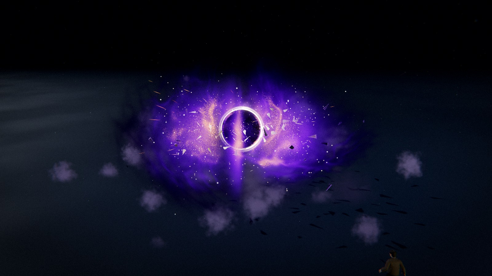

# 원소 샌드박스 — Three.js 한글판

> 원본 [achrefelouafi/LinearAbiltyCastingExtendedThreeJS](https://github.com/achrefelouafi/LinearAbiltyCastingExtendedThreeJS) 의 **포크가 아닌 한글화 사본**입니다. 모든 게임 로직·렌더링·자산은 그대로 두고 사용자 노출 문자열(메뉴, HUD, 토스트, 에디터 라벨 등)만 한국어로 옮겼습니다.

<p align="center"></p>

**<a href="https://sigco3111.github.io/LinearAbiltyCastingExtendedThreeJS/" target="_blank">🎮 라이브 플레이 — sigco3111.github.io/LinearAbiltyCastingExtendedThreeJS</a>**

스킬샷 VFX 샌드박스를 **Three.js**, **Vite**, 직접 작성한 **GLSL**로 만들었습니다.


능력 10종, 조준 방식 2종. 3종은 **직선 시전**입니다. 키를 눌러 장전하면 리그 오브 레전드식 화살표가 바닥에 나타나 마우스를 따라 흔들리고, 클릭하면 발사됩니다. 나머지 7종은 **원거리 시전**입니다. 화살표 대신 의도적으로 두꺼운 경계의 원이 커서를 따라다니며, 지면 지정 광역기가 확정 전에 답해야 하는 단 하나의 질문 — "이거 얼마나 넓게 깔리는 거야" — 에 답합니다.

---

## 능력 10종

아래 모든 장면은 시전이 정점에 이른 순간 실행 중인 샌드박스에서 렌더러가 직접 뽑아낸 출력입니다. 합성·보정 없이, 앱이 직접 그리지 않은 것은 화면에 없습니다.

<table>
<tr>
<td width="50%"></td>
<td width="50%"></td>
</tr>
<tr>
<td><b>Q — 화산 공포 수호막</b> · <sub>원거리 시전</sub><br>살아있는 용암 바닥 위에 서 있는 룬 장벽.</td>
<td><b>E — 부식 개화</b> · <sub>원거리 시전</sub><br>살아있는 산성 웅덩이 위에 선 레이마칭 독가스 기둥.</td>
</tr>
<tr>
<td></td>
<td></td>
</tr>
<tr>
<td><b>R — 수목가의 성장</b> · <sub>원거리 시전</sub><br>스스로 표적을 골라 녹색 빛의 창을 쏘는 소환수.</td>
<td><b>F — 사이버 서펜트</b> · <sub>직선 시전</sub><br>궤적 전체가 하나의 버텍스 셰이더 리본인 네온 서펜트.</td>
</tr>
<tr>
<td></td>
<td></td>
</tr>
<tr>
<td><b>V — 결정화 맹독 쇄도</b> · <sub>직선 시전</sub><br>선을 따라 찢어진 자수정 이음매가 끝에 가서 별폭발로 벌어짐.</td>
<td><b>X — 브루탈 대지 폭발</b> · <sub>직선 시전</sub><br>포토스캔 모놀리스, 먼지 충격파, 실제 탄도 파편.</td>
</tr>
<tr>
<td></td>
<td></td>
</tr>
<tr>
<td><b>B — 수묵 조류</b> · <sub>원거리 시전</sub><br>먹이 돌을 적시고 물의 벽이 일어서면, 걸린 것은 물속으로 감김.</td>
<td><b>Z — 성간 공허 폭발</b> · <sub>원거리 시전</sub><br>화면 전체를 휘게 하는 특이점, 걸린 것은 삼킴.</td>
</tr>
<tr>
<td></td>
<td></td>
</tr>
<tr>
<td><b>N — 재앙의 연쇄 표식</b> · <sub>원거리 시전</sub><br>가장 가까운 몸을 향해 한 자루씩 스스로를 던지는 칼날 왕관.</td>
<td><b>K — 천열</b> · <sub>원거리 시전</sub><br>파편이 표식에 박히다 30미터 빛 기둥으로 터져 오름.</td>
</tr>
</table>

---

## 빠른 시작

```bash
npm install
```

```bash
npm run dev
```

Vite가 찍어주는 URL을 여세요(기본 <http://127.0.0.1:5173>).

```bash
npm run build
```

```bash
npm run preview
```

### 자산

바이너리 자산은 `public/` 에서 서빙되어 부팅 때 자동으로 로드됩니다.

| 파일 | 용도 |
| --- | --- |
| `public/models/Idle.fbx` | 리깅된 캐릭터 **및** 대기 애니메이션 클립 |
| `public/models/diffuse.png` | 캐릭터 컬러 맵 |
| `public/models/cast1.fbx` | 시전 애니메이션 |
| `public/models/cast2.fbx` | 시전 애니메이션 |
| `public/models/cast3.fbx` | 시전 애니메이션 — 수호막·성장·균열·조류·연쇄의 기본값 |
| `public/models/dummy.fbx` | 허수아비 표적 |
| `public/models/snake.glb` | 사이버 서펜트의 몸통, 부팅 때 고스트 인스턴스 스트립으로 재구성 |
| `public/hdri/spruit_sunrise.hdr` | 이미지 기반 조명·결정 반사용 HDR 프로브 |

FBX들은 모두 같은 리그의 Mixamo 익스포트로, 스킨드 메시 + 애니메이션 스택 1개씩을 담고 있습니다. 캐릭터는 대기 파일에서 오고, 시전 파일들은 클립만 가져옵니다. 각 파일과 함께 딸려온 중복 리그는 `AnimationClip` 을 꺼내는 즉시 해제됩니다. 클립은 본 이름으로 스켈레톤에 바인딩되므로, 다른 파일에서 만든 애니메이션이 리타게팅 없이 그대로 재생됩니다.

리그에 머티리얼이 없으므로 `diffuse.png` 를 옆에서 로드해 임포트 머티리얼을 PBR로 변환할 때 컬러 맵으로 붙입니다. 내장 텍스처를 가진 FBX는 자기 UV 기준으로 만든 맵을 유지합니다.

각 능력은 던지는 클립을 직접 고릅니다 — 설정 블록의 `castAnim`, 에디터 폴더의 **시전** 아래 드롭다운입니다. 기본값은 수호막·성장·균열·조류·연쇄가 `cast3`, 개화·서펜트·쇄도·공허 폭발이 `cast2`, 천열이 `cast1` 입니다. 클립은 루프 대기 위에 얹는 원샷이며, 겹치는 양쪽 경계가 `character.castBlendIn` / `castBlendOut` 입니다.

HDR은 이미지 기반 조명과 결정 반사광으로만 쓰고 보이는 하늘로는 쓰지 않습니다. 무대는 평평한 어두운 배경을 유지합니다.

---

## 조작법

| 입력 | 동작 |
| --- | --- |
| **Q** (또는 **1**) | 화산 공포 수호막 장전 — 원거리 시전, 원으로 조준 |
| **E** (또는 **2**) | 부식 개화 장전 — 원거리 시전, 맹독 산성 오라 |
| **R** (또는 **3**) | 수목가의 성장 시간소환수 장전 — 스스로 표적을 고르는 원거리 시전 |
| **F** (또는 **4**) | 사이버 서펜트 장전 — 직선 시전 |
| **V** (또는 **5**) | 결정화 맹독 쇄도 장전 — 직선 시전 |
| **X** (또는 **6**) | 브루탈 대지 폭발 장전 — 직선 시전 |
| **B** (또는 **7**) | 수묵 조류 장전 — 걸린 것을 붙잡는 원거리 시전 |
| **Z** (또는 **8**) | 성간 공허 폭발 장전 — 걸린 것을 삼키는 원거리 시전 |
| **N** (또는 **9**) | 재앙의 연쇄 표식 장전 — 스스로 칼날을 던지는 원거리 시전 |
| **K** (또는 **0**) | 천열 장전 — 원거리 시전 |
| **마우스 이동** | 조준 화살표를 흔들거나 원거리 시전 원을 이동 |
| **왼쪽 클릭** | 화살표 방향으로 시전, 또는 원을 그 자리에 내려놓기 |
| **Esc** / **오른쪽 클릭** | 장전된 시전 취소 |
| **오른쪽 마우스 + 드래그** | 카메라 회전 |
| **스크롤** | 줌 |
| **G** | VFX 에디터 표시/숨기기 |
| **P** | 일시정지/재개 — *에디터는 계속 적용됩니다* |
| **C** | 활성 이펙트 전부 지우기 |
| **H** | 조작 패널 숨기기 |

`range` 와 `minRange` 는 능력별이라 선택한 슬롯에 따라 표시기 사거리가 바뀝니다. 선택 능력의 `minRange` 보다 가깝게 조준하면 빨갛게 물들고 시전을 거부합니다. 자기 발밑에 깔고 싶으면 `minRange` 를 0으로 두세요 — 모든 원거리 시전의 출고값이 그렇습니다. 자기 위에 못 떨어뜨리는 수호막은 쓸모가 반쪽이니까요. 쿨다운도 능력별이라 한 슬롯을 썼다고 다른 슬롯이 잠기지 않습니다.

---

## 프로젝트 구조

```
src/
  abilities/      Ability 베이스 클래스(이동 전선), WardAbility, AcidAbility,
                  ArborBloomAbility, CyberSerpentAbility, VenomSurgeAbility,
                  MonolithRiftAbility, SumiTideAbility, AstralVoidAbility,
                  BalefulCascadeAbility, CelestialRendAbility, 풀링 매니저
  animation/      FBX 캐릭터 로딩, AnimationMixer, 능력별 시전 클립,
                  절차적 시전 돌진
  assets/         절차적 결정·바위 지오메트리, 리본 스트립, 능력별
                  지오메트리 빌더(모놀리스, 성장, 파쇄, 천열, 서펜트)
  config/         settings.js — 모든 파라미터의 단일 진실 공급원
  core/           App, Renderer, CameraRig, Time, Layers, 공유 프레임 유니폼
  effects/        조준 화살표, 원거리 시전 원, 바닥 데칼, 균열, 파쇄판,
                  크레이터, 키네틱 워프, 버스트, 빛못, 흔들림, 섬광
  input/          InputManager(이벤트), AimController(조준 2종)
  loaders/        공유 LoadingManager를 쓰는 AssetLoader
  materials/      ObsidianMaterial, WardBarrierMaterial, WardGroundMaterial,
                  AcidPoolMaterial, ToxicMistMaterial(레이마칭 볼륨),
                  성장·서펜트·맹독·모놀리스·먹·성간·연쇄·천열 머티리얼 세트
  particles/      GPU 파티클 시스템 + 엔진, 방출기
  postprocessing/ Composer 파이프라인, 그레이드 셰이더, 왜곡 셰이더
  shaders/lib/    공유 GLSL: 노이즈 라이브러리, 공용 헬퍼
  ui/             HUD, lil-gui 에디터, 프리셋 매니저, 스타일
  utils/          수학, 색상 캐시, 풀링, 정리, 셰이더 패치
  world/          Environment(무대 조명), 바닥, 먼지, 접촉 그림자
  archive/        은퇴한 4원소 샌드박스 — archive/README.md 참고
```

---

## 내부 동작 방식

### 설정이 곧 API입니다

`src/config/settings.js` 에 조정 가능한 모든 값이 있습니다. 다른 무엇도 그 상태를 소유하지 않습니다. 셰이더·파티클 시스템·조명·후처리 패스는 매 프레임 그 객체들을 *읽기만* 합니다. 그래서 에디터가 리빌드 없이 동작합니다 — 슬라이더를 움직이면 이미 서 있는 결정밭, 다음 시전, 환경, 후처리 스택이 한 번에 바뀝니다. 프리셋 로딩은 같은 객체에 딥머지되므로 살아있는 바인딩이 전부 유효합니다.

```js
import { settings } from './config/settings.js';
settings.venom.height = 7;        // 다음 프레임에 보임, 시전 중에도
settings.ward.zoneRadius = 8;     // 이미 서 있는 수호막을 다시 펼침
settings.global.timeScale = 0.1;  // 전체 시전을 기어다니게 늦춤
```

능력 블록은 `ELEMENTS` 의 id를 키로 쓰고, "플레이어가 지금 들고 있는 능력이 뭐지"가 필요한 공유 시스템(조준 컨트롤러, 쿨다운, HUD)은 `settings[element]` 로 조회합니다. 반드시 있어야 하는 필드는 `range`, `minRange`, `speed`, `cooldown` 4개, 원거리 시전은 `zoneRadius` 가 하나 더 있습니다. 나머지는 각 능력의 영역입니다.

### "일시정지 중 편집"이 성립하는 규칙

`VenomSurgeAbility` 의 결정 레코드는 **주사위가 정한 것만** 저장합니다. 선을 따른 위치 *비율*, 반경 *비율*, 요(yaw), 단위 없는 지터 몇 개. 시전이 시작될 때 미터·라디안·초는 단 하나도 확정하지 않습니다. 모든 치수는 업데이트 루프 안에서 `settings.venom` 기준으로 해결되며, 루프는 길이 0짜리 프레임에서도 돕니다.

그래서 이미 서 있는 결정밭도 `height` 를 드래그하면 다시 자라고, `lean` 을 드래그하면 다시 기울고, `clumping` 을 드래그하면 중심선으로 다시 모입니다. 레코드가 확정하는 값은 타임스탬프뿐입니다 — 그건 치수가 아니라 사건이니까요.

4개 *형상* 컨트롤(`facets`, `taper`, `gemRough`, `bend`)은 인스턴스 변환으로 표현할 수 없어 지오메트리에 직접 굽습니다. 7면 결정이 삼각형 수백 개라 버텍스 셰이더로 근사할 것 없이 통째로 재생성해도 쌉니다. `VenomSurgeAbility#_syncGeometry` 가 4개 값을 해시해 바뀌면 결정 메시를 재구성하고 인스턴스 속성은 그대로 들고 갑니다. 그래서 재시작 상수가 아니라 라이브 슬라이더로 남습니다.

### 조준

`AimController` 는 마우스 이동 때만이 아니라 **매 프레임** 포인터를 지면 평면에 레이캐스트하므로, 시전을 장전한 채 카메라를 돌리면 커서가 가만있어도 표시기가 그 밑에서 흔들립니다. 거리를 `[minRange, range]` 로 클램프하고 0~1 등장 엔벨로프를 추적한 뒤, 원점·단위 방향·거리 3개를 담은 `cast` 이벤트 하나를 쏩니다 — `Ability#spawn` 의 시그니처와 정확히 같습니다. 시전이 뭘 하는지는 정하지 않습니다.

스케일된 시뮬레이션 델타가 아니라 **실제** 시간으로 돌리므로 샌드박스가 일시정지 중에도 표시기는 계속 움직입니다.

표시기는 2개, 컨트롤러는 1개입니다. 무엇을 그릴지는 `ELEMENT_META[element].cast` — `CastShape.LINE` 또는 `CastShape.ZONE` — 로 정하고, 두 형태가 다른 점은 *그것뿐* 입니다. 장전·클램프·검증·등장·발사는 공유하고 같은 3인자 `cast` 이벤트로 끝납니다. 조준 측면에서 원거리 시전은 끝점만 신경 쓰는 직선 시전이니까요. 그래서 구역 조준은 `Ability`, `AbilityManager`, `App` 을 하나도 안 바꿨습니다. `WardAbility` 는 중심을 `pointAt(1)` 로 읽고 거기서 바깥으로 펼칩니다.

### 원거리 시전 원

`ZoneIndicator` 는 화살표의 반대편 짝이며, 같은 두 아이디어로 만들었습니다. 미터, 텍스처 없음.

**발자국**은 UV를 표적 기준 미터로 다시 매핑하는 프래그먼트 셰이더를 얹은 쿼드 1장이라, 원 지름이 2m든 8m든 경계 띠 두께는 0.34m로 일정합니다. 띠는 화면에서 의도적으로 가장 무거운 표식입니다 — 그게 메시지 전부이니까요. 공칭 반경 중심이 아니라 `boundaryBias` 로 안팎을 나눠 *바깥* 입술이 이펙트가 끝나는 지점에 정직하게 걸리게 했습니다. 안쪽에는 림 가중 워시, 바깥으로 달리는 윤곽 고리, 뒤틀린 필라멘트, 아래쪽 팔이 긴 레티클이 있습니다. 쿼드가 시전자의 요를 들고 있어서 그 팔이 곧 진행 방향이기 때문입니다.

시전자 발밑 **도달 고리**는 리본 스트립을 원으로 구부린 것입니다. `(t, side)` 입력, 월드 위치 출력. 사거리 20m를 담는 쿼드는 40m짜리라 얇은 선 하나에 화면 가득 버려지는 프래그먼트를 셰이딩합니다.

시전을 장전하면 원이 반경을 **넘어섰다가 가라앉습니다**. 착탄 때도 트랩이 똑같이 합니다. 선형으로 커지는 원은 UI 요소처럼 읽히고, 오버슈트하는 원은 시전자가 한 짓처럼 읽힙니다.

### 화살표는 SDF 1장입니다

`AimIndicator` 는 지면 쿼드 1장입니다. 프래그먼트 셰이더가 UV를 **시전자 기준 미터**로 다시 매핑하므로 `settings.aim` 의 모든 컨트롤이 실제 치수입니다. 시전이 3m든 15m든 자루 너비는 0.42m 그대로입니다.

실루엣은 박스(자루)와 iq의 정확한 삼각형 SDF(촉)의 둥근 합집합입니다. 싼 반평면 교차는 이렇게 얕은 쐐기에서 모서리 결함이 눈에 띕니다. 그 거리장 1장에서 외곽선, 림 가중 내부 워시, 셰브론(`|x|` 로 위상을 비틀어 평평한 띠를 시전 방향 화살촉으로 만듦), 서리 노이즈와 보로노이 판, 시전자 발밑 고리, 사거리 끝 호, 착탄점의 6중 서리 로제트, 장전 때 쓸려나오는 등장까지 유도합니다.

### 산성

부식 개화는 표면이 아니라 **부피**를 중심으로 만든 세트 유일의 능력입니다. 그래서 다른 능력들이 물을 필요가 없던 질문에 답합니다. 월드에 서 있는 *물건*이 아니라 바뀌어버린 월드의 *영역*은 어떻게 다루는가.

먹구름은 **레이마칭**이지 빌보드가 아닙니다. 카메라를 도는 순간 카메라 바라보기 쿼드로 만든 가스 기둥은 죽습니다. 카드가 같이 돌고 실루엣이 안 바뀌며, 구름 안에 서 있는 것은 모든 카드 앞 아니면 모든 카드 뒤, 둘 중 하나가 됩니다. 그래서 `ToxicMistMaterial` 은 행진합니다.

- **메시는 모양이 아니라 가위입니다.** 뒷면만 그리고 뎁스 테스트를 끈 닫힌 실린더로, 볼륨이 덮을 픽셀을 래스터라이즈하는 게 유일한 일입니다. 정다각형은 원에 내접하므로 프록시를 `1 / cos(π / segments)` 로 스케일해 해석적 반경에 *외접*시킵니다. 안 하면 행진한 구름 실루엣에 납작한 면이 생기는데, 그건 변명이 안 되는 티입니다.
- **구간은 해석적입니다.** `cylinderSpan` 이 광선을 직립 실린더에 풀고 높이 슬래브로 잘라 정확한 진입·종료 거리를 줍니다. 뎁스 필링도 정렬도 없고, 카메라가 구름 안에 있어도 맞습니다.
- **장면에 클리핑됩니다.** 행진 끝을 불투명 뎁스 프리패스로 잘라 오라 안에 선 캐릭터는 앞쪽 가스만큼만 가려지고 뒤쪽 가스는 하나도 안 묻습니다. 그 한 줄이 오라와, 캐릭터를 위에 붙인 데칼의 차이입니다.
- **밑에서 조명됩니다.** 웅덩이가 키라이트고 *가스 아래*에 있으므로 발광은 높이 따라 감쇠하고, 태양 쪽으로 한 탭이면 꼭대기가 음영집니다. 구름을 평평하게 비추면 화학 화재 위 연기가 아니라 녹색 안개가 됩니다.

비용은 정직하게 다이얼됩니다. 3옥타브 fbm의 `mistSteps` 샘플 + 섀도우 탭 1개, 노이즈 평가 전에 빈 공간 스킵, 볼륨이 불투명해지면 행진 중단, 스텝 수는 **라이브 슬라이더** — 노트북과 프로젝터 머신이 같은 빌드로 돕니다.

**웅덩이**가 균형추입니다. 더하기만 할 수 있는 애디티브로는 바닥을 먹어야 하는 산이 안 되므로 알파 블렌딩입니다. 미친 듯 갈라짐은 2최근접 보로노이 *모서리* 망이라 거리장 임계값의 둥근 얼룩과 달리 갈라지고 만나는 분기점이 제대로 섭니다. 자기 높이장의 월드 공간 그라디언트로 진짜 스페큘러 로브를 들고 갑니다. 무대의 다른 모든 것은 거친데 그 광택이 *액체*라고 말해주는 제일 싼 요소입니다. 빼면 웅덩이는 녹색인 우연한 그을린 바위가 됩니다. 경계는 방위 노이즈로 밀리고 두 번째 노이즈가 파먹습니다. 안에 뭘 그렸든 깨끗한 원반은 데칼로 읽히니까요.

표면에서 올라오는 가스는 파티클이 아니라 **웅덩이 셰이더**에서 그립니다. `surfaceBoil` 이 지터된 격자의 매 셀에 자기 시계·자기 크기를 주고 표면을 깨고 나오는 거품 1개의 팽창 림을 그립니다. 픽셀당 싼 해시 9개, 두 셀이 같은 박자를 타는 일 없이 이미터 1개를 통째로 대체합니다.

파티클이 필요한 거품은 새 실루엣이 필요해서 공유 시스템에 `ParticleShape.BUBBLE` 을 추가했습니다. 막은 *뚫어지게* 볼 때 가장자리에만 보이므로 디스크가 아니라 얇은 고리 모양에, 가운데 살짝 남은 뒷벽, 키의 하드 화이트 캐치라이트, 아래 웅덩이의 부드러운 바운스를 얹습니다. 페이드아웃도 안 합니다. 수명 끝에 막이 바깥으로 튀며 얇아지고 찢어집니다. 거품의 유일한 끝이니까요.

**끓음이 다섯 패스를 하나로 묶습니다.** 수호막에 고동이 있다면 이쪽은 서로소 주파수(1, φ, 1+√2) 3사인의 합을 `boilSharp` 로 올린 봉투입니다 — 주기가 없는 봉투라 대부분 시간은 0 근처에 있다가 튑니다. 고동은 규칙적이어야 *합니다*. 화학 반응은 전혀 그렇지 않고, 오라가 서 있는 6초 안에 서지는 같은 리듬에 두 번 안 옵니다. 프레임당 한 번 평가해 모든 머티리얼·조명·이미터·카메라에 건넵니다. 서지가 `boilThreshold` 를 위로 넘으면 오라가 **분출**합니다 — 웅덩이 전체에서 가스 한 줄기, 가로지르는 고리, 카메라 한 방. `boilDepth` 를 0으로 두면 전체가 한 번에 납작해집니다. 모든 패스가 동시에요.

### 성장

수목가의 성장 시간소환수는 세트에서 *타격*이 아닌 유일한 능력입니다. 샌드박스의 다른 모든 것은 닿습니다. 선을 타고 내려가 착탄하고, `DummyField` 가 덮은 부피를 읽어 서 있던 것을 쓰러뜨립니다. 소환수는 닿지 않습니다. 서서 고릅니다. 그래서 `handlesOwnHits` 에 답하고, 필드는 내버려두고, 근처에 누가 있나 물어 표시하고 돌진해 발사합니다. 절단은 처치 위에 얹는 이펙트가 아니라 처치 *그 자체* 입니다.

**덩굴손과 잎은 한 몸입니다.** 잎은 줄기 근처 흩뿌린 장식이 아니라 줄기에 *클리핑*됩니다. 튜브와 날개는 같은 `vinePoint` / `vineFrame` / `vineRadius` 블록을 품고 같은 유니폼 박스를 id로 받으므로, 잎은 튜브가 해결한 줄기 위치를 같은 프레임에 같은 숫자로 해결합니다. 소환수가 서 있는 동안 `curl turns` 를 드래그하면 잎 300개가 목재와 함께 말립니다. 대안은 줄기를 굽는 것 — 라이브 컨트롤 상실 — 이나 GPU에서 지오메트리를 읽어오는 것 — 프레임 상실 — 입니다.

패스 버퍼도 CPU 패스도 없습니다. `vinePoint(vine, t)` 는 해석적입니다. 방위, 허리에서 부풀었다가 꽃 아래 다시 좁아지는 반경, 상승 곡선, 비틀림, 마지막 1/3에서 조여드는 나선 — 마지막 항 하나가 *압출*이 아니라 *성장*이라고 말합니다. 타고 가는 프레임은 월드 업이 아니라 줄기 자체의 바깥 법선에서 기준축을 취합니다. 수직을 지나는 덩굴손에서 요령이 뒤집히고, 뒤집힌 프레임은 튜브 두 행 사이 모든 쿼드를 나비넥타이로 비틀기 때문입니다.

**꽃은 각도 1개로 벌어집니다.** 꽃잎은 호 위에 놓인 구부러지고 오목하고 비틀린 판 — `p(u) = centre + (out·sin a + up·cos a)·(len·u)`, `a = pitch + curve·u` — 라서 20°에서 시작해 90° 휘는 꽃잎은 밑동은 서고 끝은 뒤로 젖혀집니다. 벌어진 꽃이 실제로 하는 짓입니다. `uOpen` 이 0→1로 가며 모든 꽃잎의 피치를 봉오리에서 자기 소용돌이로 보간하고 바깥 소용돌이가 이끕니다. 두 번째 포즈도 블렌딩도 없습니다. 꽃의 읽힘은 소용돌이 *쌓임* 전부이고, 그 쌓임은 vec3 3개입니다.

**이들은 애디티브 셰이더가 아니라 조명받는 머티리얼입니다.** 이 능력을 여기 다른 모든 것과 가르는 분기점입니다. 불과 번개는 *빛 그 자체*이고, 목재는 물질입니다. 태양 아래 앉고 그림자를 받고 뒤를 가리지 않는 물질은 장면에 두른 데칼로 읽힙니다.

### 에디터와 프리셋


**G** 를 누르면 패널이 옵니다. 폴더: 프리셋, 전역, 조준 표시, 원거리 시전 원, 화산 수호막, 부식 개화, 수목가의 성장, 사이버 서펜트, 결정화 맹독 쇄도, 브루탈 대지 폭발, 수묵 조류, 성간 공허 폭발, 재앙의 연쇄, 천열, 환경, 후처리, 카메라, 캐릭터, 허수아비 표적. 모든 폴더는 접힌 채로 시작합니다 — 하나만 펴도 나머지가 화면 밖으로 밀릴 만큼 컨트롤이 많습니다.

- **전역** 배율은 모든 것을 한 번에 스케일합니다(속도, 발광, 노이즈, 파티클, 조명, 충격 강도, 카메라 흔들림, 시간 배율…).
- **조준 표시** — 화살표 실루엣(미터), 외곽선과 채움, 셰브론과 서리, 고리와 로제트.
- **원거리 시전 원**(40 컨트롤) — 경계 띠, 내부, 눈금·스윕·레티클, 도달 고리, 스냅아웃. 모든 원거리 시전의 공유물이라 특정 능력이 아니라 조준 쪽에 편철됩니다.
- **화산 수호막**(230 컨트롤, 색상 45개) — 시전과 발자국, 모든 것이 따라 뛰는 고동, 기준 시트의 패스별 폴더 1개씩: 장벽, 바닥, 흑요석, 룬 띠, 코어 플레어, 열기 아지랑이, 불씨/재/혈흔/연기, 동적 광원.
- **부식 개화**(203 컨트롤, 색상 38개) — 시전, 모든 패스가 따라 끓는 끓음 봉투, 산성 웅덩이, 레이마칭 독가스, 밑 고리, 부식 반짝임, 거품과 부유 입자, 안개와 튐, 바닥 표식, 던지기·개화·유지, 동적 광원.
- **결정화 맹독 쇄도**(194 컨트롤, 색상 36개) — 시스템별이 아니라 5패널 분석 시트대로 편철되어 한 층을 보려면 폴더 하나만 열면 됩니다. *1 결정*(이음매, 별폭발, 결정 1개, 분출, 자수정), *2 가스*, *3 물방울*(밑에 공중 반짝임), *4 균열*(판, 선을 따른 표식), *5 발광*(심, 밑에 후광), 다음 일격과 조명. `slab*` 중 *재절단* 표시 4개가 보로노이를 다시 자릅니다. 판의 다른 모든 컨트롤은 이미 바닥에 누운 것을 다시 빚습니다.
- **브루탈 대지 폭발**(195 컨트롤, 색상 25개 — 설정 블록 값마다 1개, 숨김 없음) — 5패널 분석 시트대로 편철: *1 모놀리스*(균열, 군집, 판 1장, 분출, 석재 표면), *2 시멘트 먼지*(밑에 구르는 고리), *3 기하 파편*(자갈·부유 가루 포함), *4 균열 흉터*(크레이터, 균열, 선을 따른 표식), *5 키네틱 공기*, 다음 일격과 조명. *판 1장* 아래 형상 컨트롤 7개가 지오메트리를 다시 자릅니다. 나머지는 이미 서 있는 돌을 다시 빚습니다. 각 패널은 단독으로 0까지 내려 다른 층을 심판할 수 있습니다 — `density` 가 돌을 비우고, `dustOpacity` 가 공기를 치우고, `shrapnelCount` 가 잔해를 멈추고, `warpStrength` 가 굴절을 끕니다.
- **프리셋**은 `localStorage` 에 저장되며, 복제·삭제·JSON 내보내기·JSON 가져오기·출고 기본값 초기화를 지원합니다.

모든 능력은 그리는 **모든** 색상을 노출하고, 어떤 것도 다른 것에서 파생되지 않습니다. 결정 팔레트, 수호막의 막과 룬 띠, 산성 웅덩이와 위 가스, 바닥 표식, 충격 셸, 충격파 고리, 화면 섬광, 파티클 시스템마다 4정점 수명 그라데이션(탄생 → 초반 → 후반 → 소멸)까지. 결정을 건드리지 않고 안개만 물들이거나, 룬은 빨갛게 둔 채 불씨만 주황으로 식히는 게 피커 한 번 거리입니다.

프리셋은 설정 트리의 일반 스냅샷이라 내보낸 파일을 손으로 읽고 고칠 수 있습니다.

각 능력을 가장 크게 빚는 노브들입니다. 처음 손댈 것들이라 적어둡니다.

- `venom.heightCurve` — 램프가 얼마나 늦게 오르는지. 올리면 이음매가 낮게 깔리다 표적에서 폭발합니다. `venom.frontBias` 를 1 밑으로 두면 결정이 착탄점으로 모입니다.
- `ward.zoneRadius` — 원거리 시전 전체가 올라선 숫자 1개. 조준 원, 막, 룬 띠, 깨진 바닥, 모놀리스 고리를 함께, 라이브로 키웁니다. 다음은 모든 패스가 따라 뛰는 고동의 `ward.bpm` 과 `ward.beatDepth` 입니다. `beatDepth` 를 0으로 두면 수호막이 납작해집니다. 모든 패스가 한 번에요.
- `quake.density` 와 `quake.warpStrength` — 크레이터에서 돌이 얼마나 올라오고, 폭발 뒤 공기를 얼마나 세게 밀어내는지. 그 능력의 각 패널은 단독으로 0까지 내려 층끼리 심판할 수 있습니다.
- `zone.boundary` 와 `zone.snap` — 원거리 시전 원 가장자리가 얼마나 두껍게 읽히고, 나가는 길에 얼마나 세게 오버슈트하는지. 둘 사이가 그 표시기를 UI 오버레이처럼 느끼게 할지 시전자가 한 짓처럼 느끼게 할지 정합니다.

---

## 성능 노트

- 능력·데칼·버스트·파티클은 종류별 풀링입니다. 같은 자리 12연속 시전도 능력 인스턴스 **4개**까지만 만들고 할당을 멈춥니다.
- 결정밭 전체는 결정 수와 무관하게 드로우 콜 몇 개 — 결정은 개당 인스턴스가 아니라 형태 변형별 인스턴스입니다.
- 사이버 서펜트 궤적은 고스트 수와 무관하게 인스턴스 리본 스트립 **1개**입니다. 패스가 CPU를 안 타서 궤적 수는 거의 공짜입니다.
- 원거리 시전 조준 원은 드로우 콜 2개: 쿼드 1장 + 고리 스트립 1개.
- 6개 동적 점광원은 부팅 때 만들어 강도 0에 주차합니다. 더하고 빼면 머티리얼 전부가 3번씩 재컴파일됩니다.
- 장면을 여러 번 그리지만 섀도우 맵은 프레임당 정확히 1번 갱신됩니다.
- 부팅 중 `renderer.compileAsync()` 가 돌아 첫 시전이 셰이더 컴파일에 덜컥이지 않습니다.
- 픽셀비는 1.75 상한, 뎁스·왜곡 버퍼는 절반 해상도입니다.

동시 4시전 — 슬롯 출처 무관 풀 상한 — 을 기준으로 예산을 잡고, `AbilityManager` 의 `MAX_CONCURRENT` 가 넘으면 원소 무관하게 가장 오래된 것부터 은퇴시킵니다. 원거리 시전 원 장전은 드로우 콜 2개가 듭니다.

실시간 카운터(FPS, 살아있는 파티클, 인스턴스, 드로우 콜)는 HUD 오른쪽 위에 있습니다.

---

## 아카이브

`src/archive/` 에 이 프로젝트의 전신이 있습니다. 프리핸드 스플라인을 따라 시전하던 4원소(불·물·대지·바람) 샌드박스와, 같은 획을 타고 가는 워크 모드입니다. 살아있는 앱이 임포트하지 않아 Vite가 번들하지 않습니다.

선형 스킬샷으로 패스 그리기를 대체하면서 그 시스템들이 서 있던 입력이 통째로 사라져 은퇴했습니다. 특히 레이마칭 불·수면은 캐낼 가치가 있습니다. 뭐가 있고 어떻게 살리는지는 `src/archive/README.md` 참고.

---

## 알려진 거친 부분

- 결정은 `transparent: true` + `depthWrite: true` 로 그립니다. 거의 불투명한 결정에는 맞는 절충이고 결정밭이 자기 안에서 정렬 뒤집히는 것도 막지만, `venom.gemOpacity` 가 낮으면 겹친 쐐기 사이 정렬 결함이 보입니다.
- 분출 전선은 평평한 바닥 위 직선입니다. 두 가정 다 고정입니다 — 지면은 y = 0 평면 1장, 조준 레이캐스트는 그 평면을 겨냥합니다.
- 충격 군집은 끝점 둘레 방사 배치라 시전 거리가 아주 짧으면 뒤 띠와 겹쳐야 할 만큼 겹칩니다.
- 원거리 시전은 평평 바닥 가정을 두 번 물려받습니다. 원은 `y = 0` 쿼드 1장에 그리고, 수호막의 룬 띠와 파쇄판도 같은 평면에 붙습니다. 단차 위로는 드리우지 않습니다.
- 조준 원은 애디티브라 발자국이 바닥을 가리기보다 밝힙니다. 옅은 바닥에서는 경계를 읽히게 하려면 밑에 비애디티브 패스 1장이 필요합니다.

---

## 라이선스

코드는 이 프로젝트 용도로 있는 그대로 제공됩니다. 동봉된 HDR 프로브와 캐릭터 FBX는 원본 라이선스를 유지합니다.

---

## 원본 문서

기술 심층 문서(조준 SDF, 산성 레이마칭, 소환수 구조 등)의 영문 원본은 [`docs/README.en.md`](docs/README.en.md) 에 보존되어 있습니다.

## 한글화 노트

- 사용자 노출 문자열만 한국어화했습니다. 셰이더·식별자·설정 키·주석은 원문 그대로입니다.
- 원작자 홍보 카드(우하단 연락처 패널)는 제거했습니다.
- 스크린샷 11장은 `docs/screenshots/` 에 원본 그대로 있습니다.
